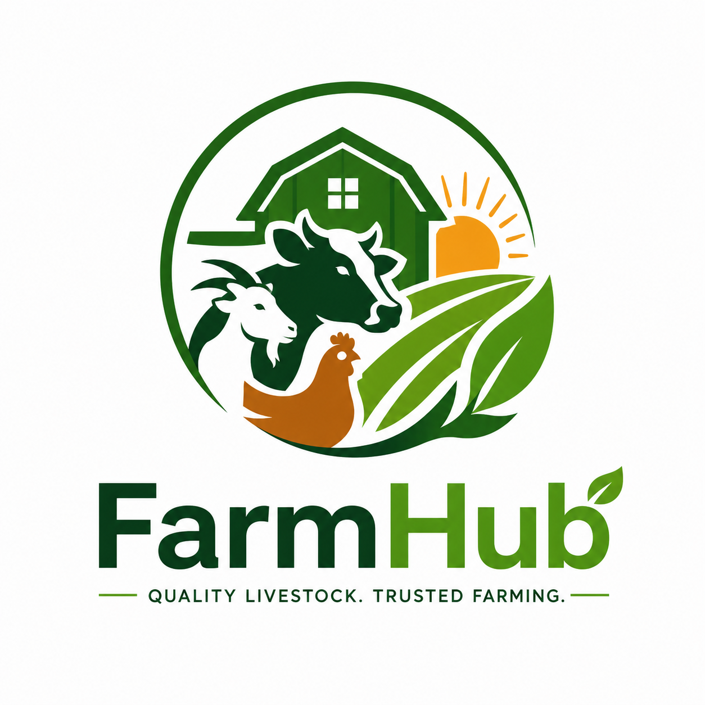
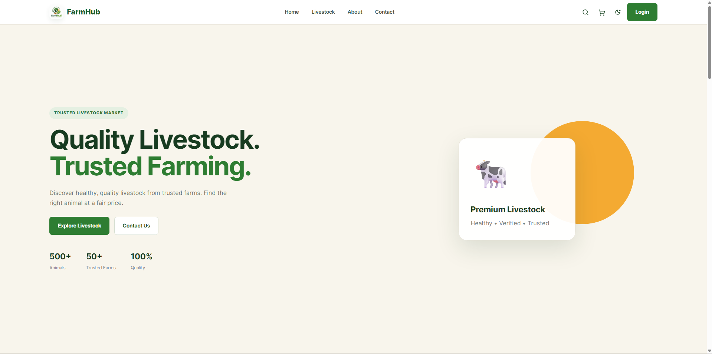

# 🐄 FarmHub



<div align="center">
  
</div>

FarmHub is a modern livestock marketplace built to help buyers discover healthy, verified animals and help sellers manage listings with confidence. The platform combines a premium storefront, secure authentication, responsive dashboards, and reliable commerce flows into one streamlined experience.



## 🌾 Project Overview

FarmHub is designed to simplify livestock buying while improving trust and transparency in the process. It brings together:

- a polished marketplace landing page
- animal category browsing and filtering
- detailed livestock pages with pricing and features
- wishlist, cart, and checkout experiences
- farmer and admin dashboard workflows
- Clerk-powered authentication
- responsive, mobile-friendly UI with premium styling

## ✨ Key Features

### Customer Experience

- Browse premium livestock listings by category
- View detailed animal profiles and pricing
- Add animals to cart and manage orders
- Complete checkout flow and order tracking
- Access dashboards for profile, orders, wishlist, and settings

### Admin & Seller Tools

- Admin overview dashboard
- Inventory and animal management screens
- User and order monitoring panels
- Revenue, coupon, notification, and settings areas
- Business control views for marketplace operations

### Security & UX

- Clerk-based authentication and protected routes
- Responsive layout across desktop and mobile
- Dark mode support
- Toast notifications and polished user feedback
- Error handling, 404 pages, and clean navigation

## 🛠️ Tech Stack

### Frontend

- React
- Vite
- React Router DOM
- Lucide React
- Clerk
- CSS and custom component styling

### Backend

- Node.js
- Express.js
- MongoDB
- Mongoose
- JWT-friendly API patterns

## 📁 Project Structure

```text
FarmHub/
├── client/
│   ├── public/
│   ├── src/
│   ├── package.json
│   ├── vite.config.js
│   └── README.md
├── server/
│   ├── config/
│   ├── controllers/
│   ├── middleware/
│   ├── models/
│   ├── routes/
│   ├── server.js
│   └── package.json
├── .gitignore
└── README.md
```

## ✅ Prerequisites

Before you begin, make sure you have:

- Node.js 18 or newer
- npm or yarn
- MongoDB running locally or a valid MongoDB URL
- Clerk publishable key for authentication

## ⚙️ Environment Setup

### Client environment

Create a .env file inside the client folder:

```env
VITE_CLERK_PUBLISHABLE_KEY=your_clerk_publishable_key
```

### Server environment

Create a .env file inside the server folder:

```env
PORT=5000
MONGODB_URI=mongodb://127.0.0.1:27017/farmhub
JWT_SECRET=your_secure_jwt_secret
```

## 🚀 Installation

### 1) Install frontend dependencies

```bash
cd client
npm install
```

### 2) Install backend dependencies

```bash
cd server
npm install
```

## ▶️ Running the Project

### Start the backend

```bash
cd server
npm run dev
```

### Start the frontend

```bash
cd client
npm run dev
```

### Default local URLs

- Frontend: http://localhost:5173
- Backend: http://localhost:5000

## 📦 Available Scripts

### Client

```bash
npm run dev
npm run build
npm run preview
npm run lint
```

### Server

```bash
npm run dev
```

## 🏗️ Production Build

To create a production build:

```bash
cd client
npm run build
```

This generates the dist folder, which is ready for deployment to static hosting providers or a production frontend host.

## 🌍 Deployment

### Frontend

- Vercel

### Backend

- Render

### Database

- MongoDB Atlas

## 👨‍💻 Author

### Ahmad Raza

- Software Engineering Student
- React Developer
- Full Stack Developer
- AI Enthusiast

### Social Links

- GitHub: [github.com/Raza11220](https://github.com/Raza11220)
- LinkedIn: [www.linkedin.com/in/ahmad-raza112200](https://www.linkedin.com/in/ahmad-raza112200/)

## 🧭 Roadmap

Planned improvements include:

- full payment integration
- advanced order and inventory syncing
- role-based admin permissions
- richer seller onboarding flows
- analytics and reporting

## 📄 License

This project is licensed under the MIT License.

## 🤝 Contact

For project support, partnership opportunities, or business inquiries, reach out through the FarmHub contact section or official support channels.

⭐ If you like this project, don't forget to give it a Star.
